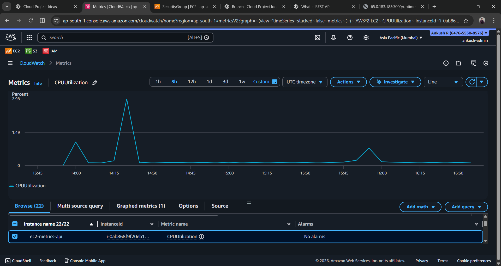
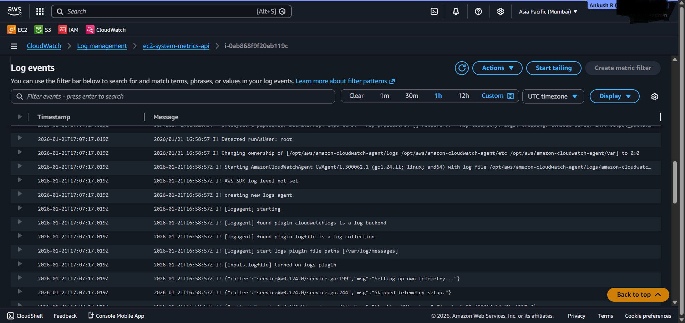

# EC2 System Metrics REST API

A system-level REST API deployed on AWS EC2 to expose basic server metrics and demonstrate cloud infrastructure, monitoring, and operational best practices.

This project focuses on Cloud engineering fundamentals.

## 🔹 Architecture Overview

User → AWS Security Group → EC2 (Amazon Linux) → Flask REST API  
                                         ↓  
                                  CloudWatch Metrics & Logs

## 🔹 Features

- REST API exposing system metrics
- Deployed on AWS EC2 (Free Tier)
- Runs as a persistent `systemd` service
- Secure SSH access using security groups
- Centralized monitoring using Amazon CloudWatch
- Cost-aware design (instance terminated after validation)

## 🔹 API Endpoints

| Endpoint  | Description 
| `/health` | Service health status 
| `/cpu`    | CPU utilization 
| `/memory` | Memory usage 
| `/disk`   | Disk usage 
| `/uptime` | Instance uptime 

## 🔹 AWS Services Used

- **EC2** – Compute
- **Security Groups** – Network access control
- **IAM Role** – Secure permissions
- **CloudWatch Metrics** – Performance monitoring
- **CloudWatch Logs** – Centralized logging

---

## 🔹 Monitoring & Observability

Amazon CloudWatch was used to monitor:
- EC2 CPU utilization
- Centralized system and application logs

### CloudWatch CPU Metrics

### CloudWatch Logs

## 🔹 Deployment Summary

1. Launched an EC2 instance using Amazon Linux
2. Installed Python dependencies (Flask, psutil)
3. Deployed the REST API
4. Configured the application as a `systemd` service
5. Installed and configured the CloudWatch Agent
6. Verified metrics and logs via CloudWatch

> The EC2 instance was terminated after validation to avoid unnecessary cloud costs.

## 🔹 Purpose of This Project

This project was built to demonstrate:
- Cloud compute fundamentals
- Linux service management
- Secure networking practices
- Monitoring and observability using AWS
- Cost-conscious cloud usage

It is intended for learning and portfolio demonstration.
